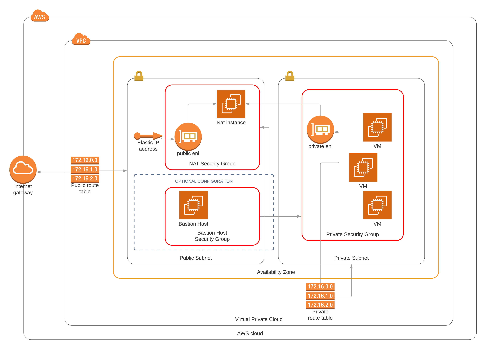

# EC2 NAT instance in AWS

## Project overview
This configuration assumes that you already have a VPC, a private subnet, some VMs in the private subnet, a private security group for those machines, and a private route table. The following image shows the expected infrastructure:


The terraform configuration of this project creates an EC2 machine and its required network resources to use it as a Nat instance. Additionally it creates a bastion host to simplify the management of the other machines. The image below shows the infrastructure created by terraform:



## Required tools and files

### Make
To simplify the management of the configuration modules, a Makefile has been created. You can still execute the terraform deployment without the make library but it implies using longer commands.

### Terraform
First you need terraform installed in your machine, information about this can be found [here](https://learn.hashicorp.com/terraform/getting-started/install.html).

### Terraform modules and plugins

Once you have terraform installed, you need to install the modules and plugins used in this project. To install them you only need to execute:
```
make install
```
in the root folder of this project.

### AWS cli
A configured aws cli is needed to avoid passing the aws variables to the terraform scripts. More information about configuring and installing the client [here](https://docs.aws.amazon.com/cli/latest/userguide/install-cliv2.html).

### tfvars file

To avoid storing configuration values that could give clues about our infrastructure, a `main.tfvars` file is required with the following variables: 
```
key_name = ""
vpc_id = ""
private_subnet_id = ""
private_sg_id = ""
private_route_table_id = ""
```

The `key_name` variable is the **name** of your ssh key used to manage the EC2 instances. You don't need to pass explicitly any key.

You can also modify the variables in the file `variables.tf` to adapt the configuration to your needs. Take into account that the script created to configure the nat instance has been tested in an Amazon Linux AMI and could not work in other instance type.

## Deploying the infrastructure

To deploy the infrastructure (assuming that you have a `tfvars` file called `main.tfvars` in the root folder of the project), you only need to execute the command:
```
make deploy-all
```


## Deleting the infrastructure
To avoid incurring in extra costs, when you finish using the infrastructure, remember to delete the created resources with the command:
```
make delete-all
```

## Upgrading the infrastructure

### High-Availability

This terraform configuration only deploys one nat instance in one availability zone and links it with one private subnet. If you have several private subnets in several availability zones, the recommended strategy to follow is to deploy one nat instance for each availability zone in use, and then make the nat instances to monitor each other. In case one of the instances goes down, the other instances should have the rights to power on and reconfigure a new instance in the availability zone where the machine has failed.

More information about this use case can be found [here](https://aws.amazon.com/articles/high-availability-for-amazon-vpc-nat-instances-an-example/).

### Increase the security

If you deploy the infrastructure with the `make deploy-all` command, a bastion host is also deployed for managing the nat instance and accessing the machines in the private subnet. To increase the security you can delete the bastion host with the command:

```
make delete-bastion
```
Take into account that you will need other method (like a private vpn) to access the instances of the private subnet.

If you want to redeploy the bastion instance, you only have to execute:
```
make deploy-bastion
```

If you don't want a bastion host from the beggining, you can create the insfrastructure with the command:
```
make deploy-nat
```

### More security !!

You can also modify the script `instances/user_data.sh.tpl` to add more iptables rules, like logging the dropped packages of the filter table, or antispoofing filtering in the prerouting chain of the nat table.

Check the next section to know how to update the instance with the new rules.


### Whitelisting ports without accessing the nat instance

The users can modify the script in `instances/user_data.sh.tpl` to modify the firewall or the nat configuration as needed.
Once the script file has been changed, the new infrastructure can be updated with the command:

```
make deploy-nat
```

Be aware that **you will not have external internet access** from your private network while the instance is being redeployed (~ 3 minutes of downtime).
